# 🏥 6thSense - AI-Powered Health Intelligence Platform

<div align="center">


**An intelligent healthcare platform that leverages AI/ML to provide predictive health insights, medication adherence tracking, and personalized wellness journeys.**

[Features](#-features) • [Tech Stack](#-tech-stack) • [Installation](#-installation) • [Usage](#-usage) • [Architecture](#-architecture) • [Contributing](#-contributing)

</div>

---

## 📋 Overview

**6thSense** is a comprehensive health monitoring and prediction platform designed to empower patients and healthcare providers with AI-driven insights. The platform combines real-time health data analytics, predictive modeling, and wellness tracking to provide a 360-degree view of patient health.

Named after the intuition to "sense" health patterns before they become critical, 6thSense brings artificial intelligence to predictive healthcare.

---

## 🎥 Demo

![Demo]
<video src="static/videos/demo.mp4" controls width="700"></video>
---

## 📸 Screenshots

### 🏠 Home Page
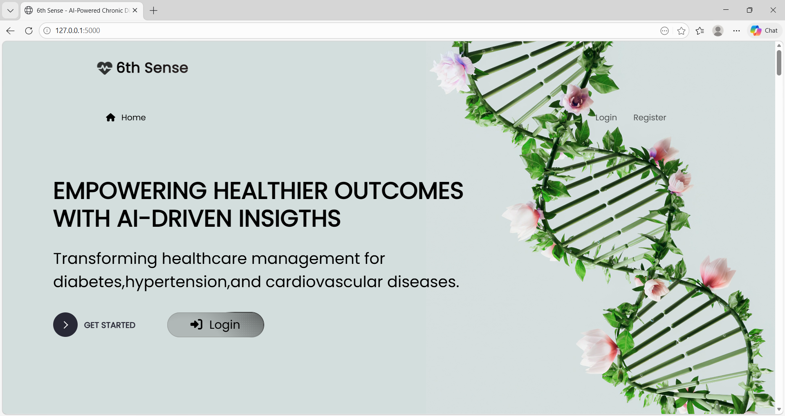
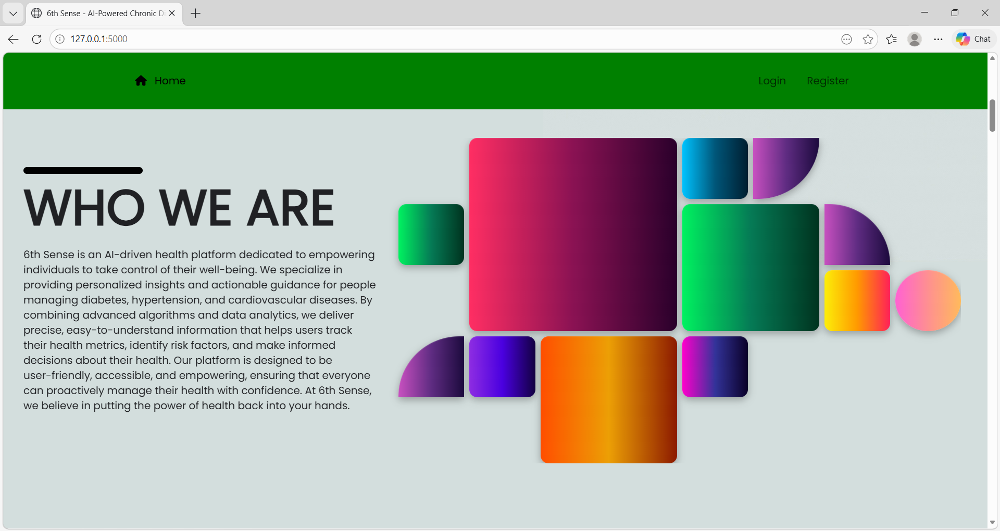
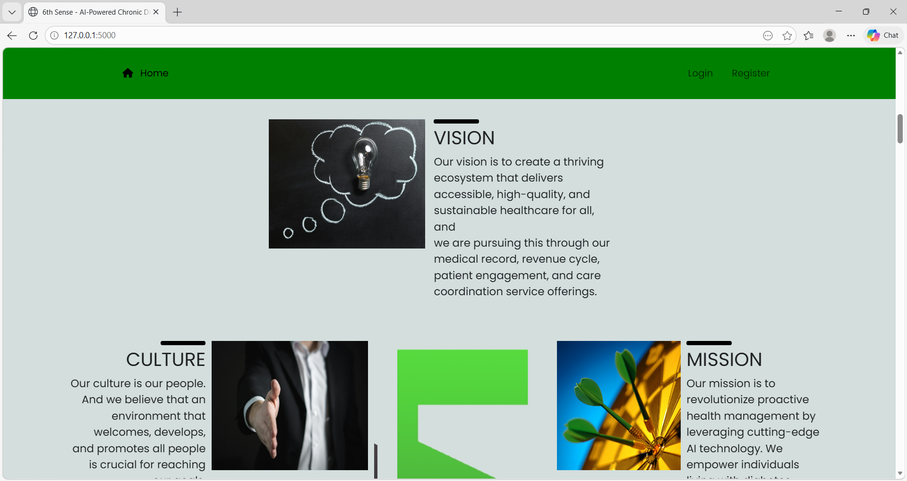
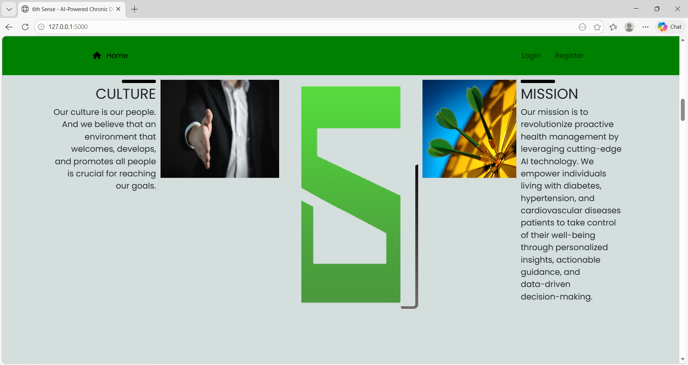

### 🏠 Dashboard
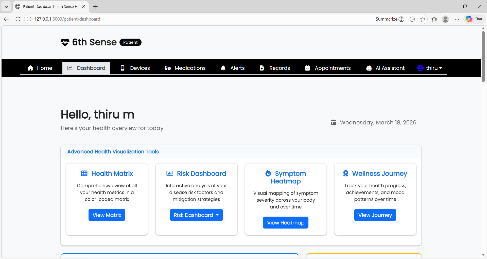

### 📊 AI Predictions
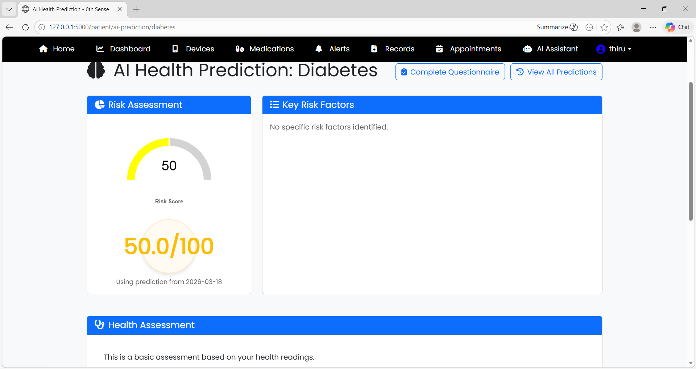

### 💬 AI Chatbot
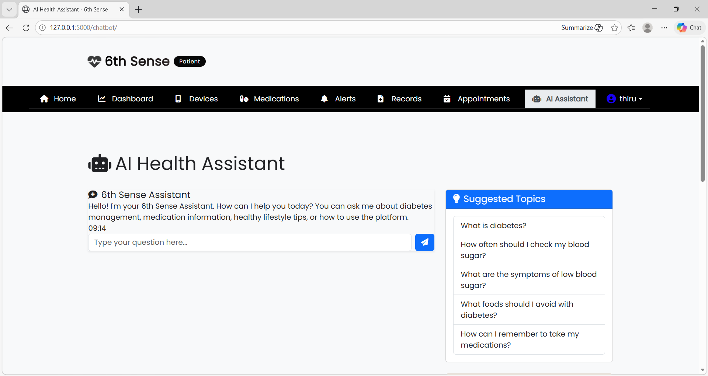

### 💊 Medication Tracking
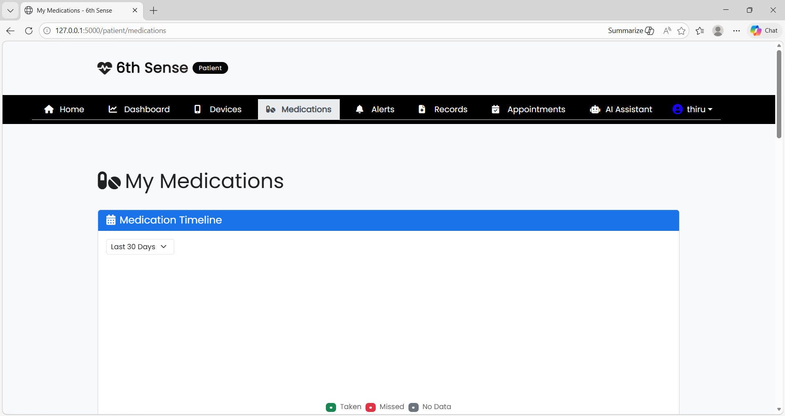

### 🔐 Authentication
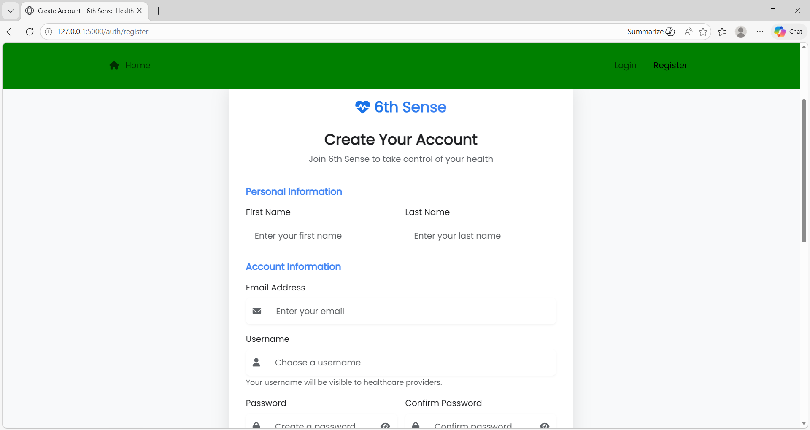
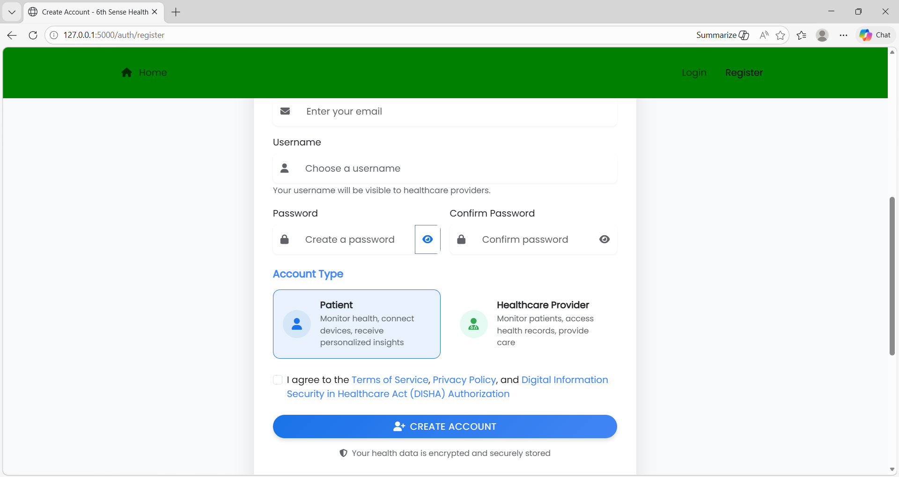
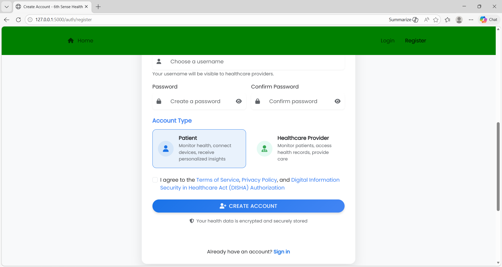

### 🔐 Login
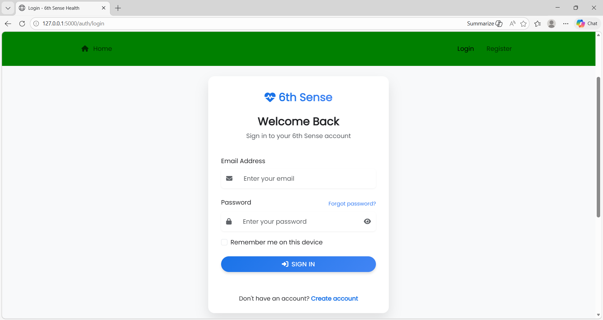

---

## ⚡ Quick Preview

- 🤖 AI-powered disease risk prediction (Diabetes, Hypertension, Cardiovascular)
- 📊 Real-time health monitoring dashboard
- 💊 Medication adherence & tracking system
- 💬 AI chatbot for healthcare assistance
- 🏥 Doctor-patient management with role-based access

---

## ✨ Features

### 🔍 **AI-Powered Predictions**
- **Multi-condition risk assessment** for Diabetes, Hypertension, and Cardiovascular diseases
- **Gemini AI integration** for advanced health analysis
- **Confidence-based predictions** with detailed risk scoring (0-100)
- **Rule-based fallback predictions** for continuous availability
- **Key factor identification** to understand what drives risk

### 👥 **User Management**
- **Dual-role system**: Patients and Healthcare Providers
- **Secure authentication** with Flask-Login
- **Patient profiles** with medical history and preferences
- **Provider integration** with specialty tracking and patient management
- **Admin capabilities** for system oversight

### 📊 **Health Data Management**
- **Real-time health readings** (Blood Glucose, Blood Pressure, Pulse)
- **Multiple device support** (Glucometers, BP monitors, wearables)
- **Medical device integration** for seamless data sync
- **Abnormal reading detection** with automated alerts
- **Medication tracking** with adherence logs and reminders

### 🎯 **Advanced Wellness Features**
- **Mood tracking** with emoji-based sentiment analysis (1-5 scale)
- **Symptom heatmap** with color-coded severity tracking
- **Wellness journey** with gamification (badges, levels, points)
- **Achievement badges** (Bronze, Silver, Gold, Platinum, Diamond)
- **Milestone tracking** for personalized health goals

### 💊 **Treatment & Care Management**
- **Personalized treatment recommendations** with confidence scoring
- **Medication management** with dosage and frequency tracking
- **Test appointment scheduling** for lab work and diagnostics
- **Health records management** with file support (PDF, images)
- **Record consent system** for privacy-controlled data sharing

### 🏥 **EMR Integration**
- **External system connectivity** (Hospital systems, Labs, EMRs)
- **Bidirectional data sync** with healthcare providers
- **Data mapping** between systems
- **Integration logging** for audit trails
- **Multiple authentication methods** (OAuth2, API Key, JWT)

### 💬 **AI Chatbot**
- **Multi-language support** (extensible language system)
- **Session management** for conversation continuity
- **Health-related Q&A** powered by AI

### 📱 **Health Questionnaires**
- **Condition-specific surveys** (Diabetes, Hypertension, Cardiovascular)
- **Multiple question types** (Multiple choice, Boolean, Text, Numeric)
- **Weighted scoring** for AI prediction accuracy
- **Dynamic questionnaire system** with response tracking

---

## 🛠 Tech Stack

### **Backend**
| Component | Technology |
|-----------|-----------|
| **Framework** | Flask (Python) |
| **Database** | PostgreSQL |
| **ORM** | SQLAlchemy |
| **Authentication** | Flask-Login, Werkzeug |
| **API** | Flask Blueprints (modular routes) |

### **Frontend**
| Component | Technology |
|-----------|-----------|
| **Markup** | HTML5 (60.5%) |
| **Styling** | CSS3 (6.6%) |
| **Interactivity** | JavaScript (4.1%) |
| **Templating** | Jinja2 |

### **AI/ML**
| Component | Technology |
|-----------|-----------|
| **AI Provider** | Google Gemini API |
| **Fallback System** | Rule-based heuristics |
| **Data Processing** | Python/NumPy compatible |

### **Infrastructure**
| Component | Technology |
|-----------|-----------|
| **Package Management** | UV |
| **Environment** | Python 3.11+ |

---

## 📁 Project Structure

```
6thsense/
├── app.py                          # Flask application factory & config
├── models.py                       # SQLAlchemy database models (27KB)
├── main.py                         # Entry point
├── alter_table.py                  # Database migration utilities
├── routes/                         # Modular route blueprints
│   ├── auth.py                    # Authentication routes
│   ├── patient.py                 # Patient portal routes
│   ├── provider.py                # Provider portal routes
│   ├── api.py                     # RESTful API endpoints
│   ├── chatbot.py                 # Chatbot endpoints
│   └── emr_integration.py         # EMR integration routes
├── services/                       # Business logic services
��   ├── ai_predictions.py          # Gemini AI predictions
│   ├── questionnaire.py           # Questionnaire management
│   └── [other services]           # Additional services
├── templates/                      # Jinja2 templates
├── static/                         # Static assets (CSS, JS)
├── pyproject.toml                 # Project configuration & dependencies
├── uv.lock                        # Dependency lock file
└── [HTML components]              # Pre-built HTML sections
    ├── adherence_stats.html
    ├── health_matrix_section.html
    ├── medication_js.html
    ├── medication_timeline_top.html
    └── new_scripts_block.html
```

---

## 🚀 Installation

### **Prerequisites**
- Python 3.11+
- PostgreSQL 12+
- Git

### **Setup Steps**

1. **Clone the repository**
   ```bash
   git clone https://github.com/thiru2935/6thsense.git
   cd 6thsense
   ```

2. **Create virtual environment**
   ```bash
   python3 -m venv venv
   source venv/bin/activate  # On Windows: venv\Scripts\activate
   ```

3. **Install dependencies**
   ```bash
   pip install -r requirements.txt
   # or with UV
   uv pip install -r requirements.txt
   ```

4. **Configure environment variables**
   ```bash
   cp .env.example .env
   # Edit .env with your configuration:
   # - DATABASE_URL
   # - GEMINI_API_KEY
   # - SECRET_KEY
   ```

5. **Initialize database**
   ```bash
   python
   >>> from app import app, db
   >>> with app.app_context():
   ...     db.create_all()
   ```

6. **Run the application**
   ```bash
   python main.py
   ```

   The app will be available at `http://localhost:5000`

---

## 📖 Usage

### **For Patients**
1. **Create Account**: Register as a patient
2. **Add Health Devices**: Connect glucometer, BP monitor, or other devices
3. **Log Health Data**: Record readings manually or sync from devices
4. **Get AI Insights**: View risk assessments and predictions
5. **Track Wellness**: Log mood, symptoms, and medications
6. **Access Recommendations**: Get personalized treatment suggestions

### **For Healthcare Providers**
1. **Create Account**: Register as a provider
2. **Manage Patients**: View assigned patient list
3. **Review Health Data**: Access comprehensive health records
4. **Monitor Predictions**: Track risk assessments
5. **Share Records**: Send consented health information
6. **Track Adherence**: Monitor medication compliance

### **API Endpoints** (Sample)
```
POST   /api/health-reading          # Submit health reading
GET    /api/predictions/{patient_id}  # Get predictions
POST   /api/treatment-recommendation  # Generate recommendations
GET    /api/health-records          # Retrieve health records
POST   /api/questionnaire           # Submit questionnaire response
```

---

## 🏗 Architecture

### **Database Schema Highlights**
- **User & Authorization**: User, PatientProfile, ProviderProfile
- **Health Data**: HealthReading, Device, Alert, Medication
- **Predictions**: PredictionModel, Prediction, RiskFactorInteraction
- **Wellness**: MoodEntry, WellnessJourney, WellnessBadge, SymptomHeatmapEntry
- **Care**: HealthRecord, RecordConsent, TestAppointment, TreatmentRecommendation
- **Integration**: ExternalSystem, SystemConnection, DataMapping, IntegrationLog

### **AI Prediction Pipeline**
1. **Data Collection**: Aggregate health readings and questionnaire responses
2. **Feature Engineering**: Extract relevant health metrics
3. **Gemini API Call**: Send to Google Gemini for analysis
4. **Response Parsing**: Extract risk score, factors, assessment, recommendations
5. **Data Storage**: Save predictions to database
6. **Fallback**: Use rule-based heuristics if AI is unavailable

### **Key Models (Database)**
- **40+ database models** supporting complex health data relationships
- **Cascade deletion** for data integrity
- **Flexible JSON storage** for semi-structured data (recommendations, parameters)
- **Audit trails** for integration logs and user actions

---

## 🔐 Security Features

- ✅ **Password hashing** with Werkzeug security
- ✅ **Session-based authentication** with Flask-Login
- ✅ **Record consent system** for data access control
- ✅ **Role-based access** (Patient, Provider, Admin)
- ✅ **Secure credential storage** (encrypted in production)
- ✅ **Integration audit logs** for compliance

---

## 🤝 Contributing

Contributions are welcome! Here's how you can help:

1. **Fork** the repository
2. **Create** a feature branch (`git checkout -b feature/amazing-feature`)
3. **Commit** your changes (`git commit -m 'Add amazing feature'`)
4. **Push** to the branch (`git push origin feature/amazing-feature`)
5. **Open** a Pull Request

### **Development Guidelines**
- Follow PEP 8 for Python code
- Use meaningful commit messages
- Add tests for new features
- Update documentation

---

## 📊 Language Composition

- **HTML**: 60.5% (Frontend markup)
- **Python**: 28.8% (Backend logic)
- **CSS**: 6.6% (Styling)
- **JavaScript**: 4.1% (Interactivity)

---

## 🗺 Roadmap

- [ ] Mobile app (iOS/Android)
- [ ] Advanced ML models (custom trained)
- [ ] Video consultations
- [ ] Integration with major EHR systems
- [ ] Wearable device support (Apple Watch, Fitbit)
- [ ] Real-time alerts and notifications
- [ ] Multi-language UI

---

## 📝 License

This project is licensed under the MIT License - see the [LICENSE](LICENSE) file for details.

---

## 💬 Support

Have questions or need help? 

- 📧 **Email**: thiru291435@gmail.com
- 🐛 **Issues**: [GitHub Issues](https://github.com/thiru2935/6thsense/issues)
- 💭 **Discussions**: [GitHub Discussions](https://github.com/thiru2935/6thsense/discussions)

---

## 🙏 Acknowledgments

- **Google Gemini API** for AI-powered health insights
- **Flask & SQLAlchemy** for robust backend framework
- **PostgreSQL** for reliable data storage
- **Healthcare community** for inspiration and guidance

---

<div align="center">

**Made  by Thiru**

[⬆ Back to top](#-6thsense---ai-powered-health-intelligence-platform)

</div>